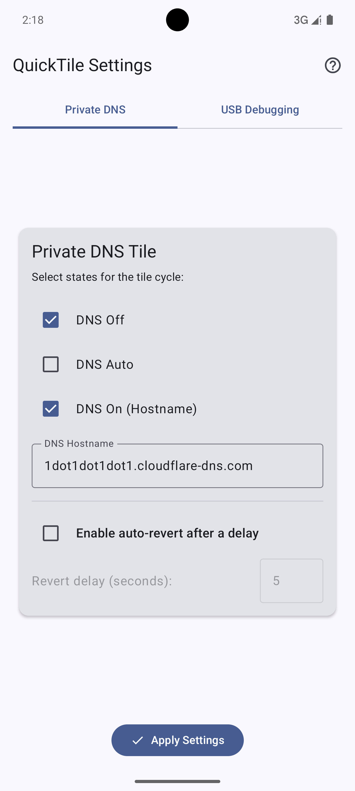
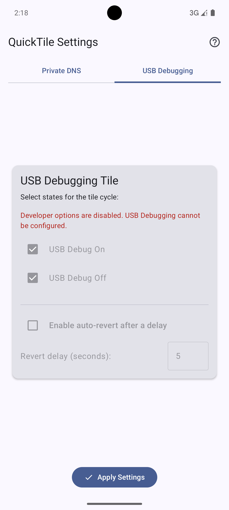
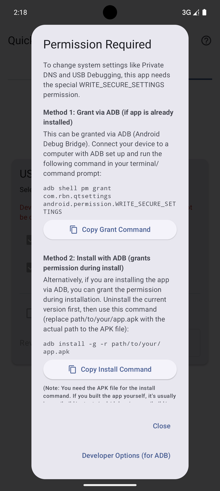
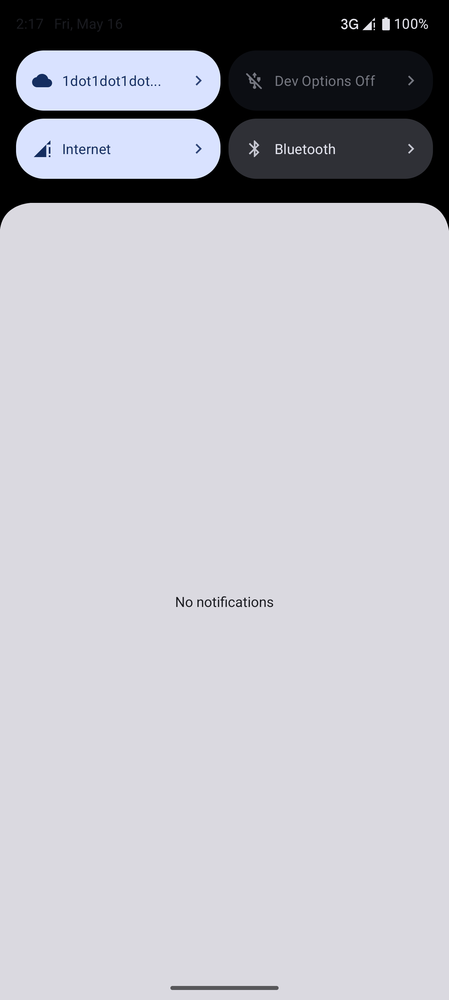

# Quick-Tile Settings

**Quick-Tile Settings** is an Android application that provides customizable Quick Settings tiles for managing Private DNS and USB Debugging. It allows users to quickly toggle these settings and configure the behavior of each tile, including an auto-revert feature.

A significant portion of the Private DNS tile functionality and concept is inspired by Joshua Wolfsohn's [Private DNS Quick Tile](https://github.com/joshuawolfsohn/Private-DNS-Quick-Tile) app. This project aims to expand on that idea by adding more features, a USB Debugging tile, and a modern Jetpack Compose UI.

## Features

*   **Private DNS Quick Tile:**
    *   Cycle through Off, Auto, and On (with custom hostname) states.
    *   Configure which states are included in the cycle via the app.
    *   Set a custom hostname for the "On" state.
    *   Optional: Automatically revert to the previous DNS state after a configurable delay.
*   **USB Debugging Quick Tile:**
    *   Toggle USB Debugging On or Off.
    *   Configure whether to cycle between On/Off or only include specific states.
    *   Optional: Automatically revert to the previous USB Debugging state after a configurable delay.
*   **User-Friendly Configuration:**
    *   In-app settings screen to customize tile behavior and auto-revert options.
    *   Tabbed interface for easy navigation between Private DNS and USB Debugging settings.
*   **Permission Guidance:**
    *   Clear instructions and an in-app help dialog for granting the required `WRITE_SECURE_SETTINGS` permission via ADB.
    *   Convenient "Copy Command" buttons for ADB commands.
*   **Modern UI:** Built with Jetpack Compose, supporting dynamic color (Material You) on Android 12+.
*   **Localization:** Available in English and German.

## Screenshots

<p align="center">
  
  
  
  
</p>

## Requirements

*   Android 9 (Pie, API 29) or higher.
*   The `WRITE_SECURE_SETTINGS` permission. This **must** be granted via ADB (Android Debug Bridge) as it's a protected permission.

## Setup and Usage

### 1. Grant Permission via ADB

This app requires the `WRITE_SECURE_SETTINGS` permission to modify system settings for Private DNS and USB Debugging. This permission cannot be granted by the app itself and must be granted using ADB from a computer.

1.  **Enable Developer Options and USB Debugging on your Android device:**
    *   Go to `Settings > About phone`.
    *   Tap on `Build number` repeatedly (usually 7 times) until you see a message saying "You are now a developer!".
    *   Go to `Settings > System > Developer options` (the location might vary slightly by device).
    *   Enable `USB debugging`.
2.  **Connect your device to your computer** via USB.
3.  **Ensure ADB is installed** on your computer. (Search "install ADB" for instructions specific to your OS).
4. Now you have two options to grant the permission:
    *   **Option 1:** Grant the permission using the following command:
        ```bash
        adb shell pm grant com.rbn.qtsettings android.permission.WRITE_SECURE_SETTINGS
        ```
        This command will grant the required permission to the app.
    *   **Option 2:** Install the app with the permission granted:
        ```bash
        adb install -g -r path/to/your/app.apk
        ```
        This command will install the app and grant the required permission in one step. (-g flag grants all runtime permissions at install time, and -r flag allows reinstallation of the app).
   
    The app also provides a help dialog (accessible via the help icon in the app's toolbar) with this command and an option to copy it.

### 2. Configure Tiles in the App

1.  Open the **Quick-Tile Settings** app.
2.  You'll see a warning if the permission hasn't been granted. Use the help icon if needed.
3.  Navigate to the **"Private DNS"** or **"USB Debugging"** tab.
4.  **Select Cycle States:** Check the boxes for the states you want each tile to cycle through (e.g., for DNS: Off, Auto, On).
5.  **DNS Hostname:** If you enable "DNS On (Hostname)" for the Private DNS tile, enter your desired private DNS provider's hostname.
6.  **Auto-Revert (Optional):**
    *   Enable "Enable auto-revert after a delay".
    *   Set the "Revert delay (seconds)". The setting will revert to its previous state after this many seconds.
7.  Tap the **"Apply Settings"** button (checkmark icon at the bottom). A snackbar will confirm that settings are saved.

### 3. Add Tiles to Your Quick Settings Panel

1.  Pull down your notification shade fully to reveal the Quick Settings panel.
2.  Tap the **"edit" icon** (often a pencil) or an option like "Edit tiles".
3.  Find the **"Private DNS"** and **"USB Debugging"** tiles provided by this app (they will have the app's icon or a relevant icon for DNS/USB).
4.  Drag and drop them from the "available tiles" area to your active tiles area.
5.  Arrange them as desired and tap "Done" or the checkmark.

### 4. Using the Tiles

*   **Tap a tile** in your Quick Settings panel to cycle it to the next configured state.
*   **Long-press a tile** to open the Quick-Tile Settings app.

## Auto-Revert Feature Explained

*   When auto-revert is enabled for a tile:
    *   Tapping the tile to change a setting will initiate a countdown timer (visible via a toast message).
    *   If no further action is taken, the setting will automatically revert to the state it was in *before* you tapped the tile once the timer finishes.
    *   If you tap the tile *again* before the timer finishes, the auto-revert for the *previous* change is cancelled. The tile will proceed to its next state, and if that new state change also has auto-revert configured, a *new* timer will begin.
*   This feature is useful for temporarily enabling a setting (like USB Debugging for a quick ADB command or you want to visit an advertisement website on purpose once) and having it automatically disable itself for security or convenience.

## Building from Source

1.  Clone this repository:
    ```bash
    git clone https://github.com/RBN-Apps/Quick-Tile-Settings.git
    ```
2.  Open the project in Android Studio.
3.  Let Gradle sync and download dependencies.
4.  Build the project (e.g., `Build > Make Project` or `Run 'app'`).
    The APK will typically be found in `app/build/outputs/apk/debug/` or `app/build/outputs/apk/release/`.
