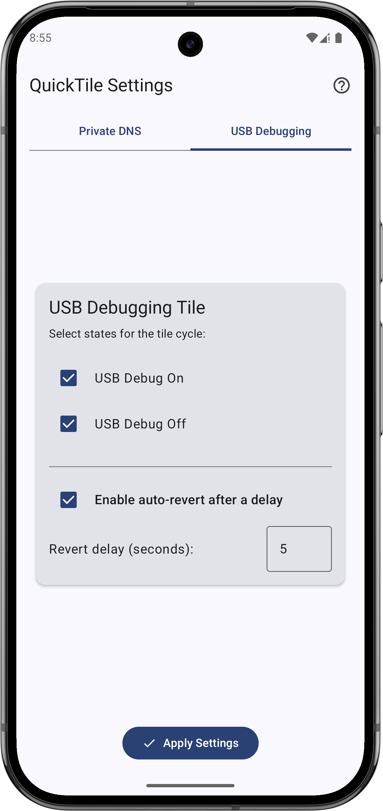
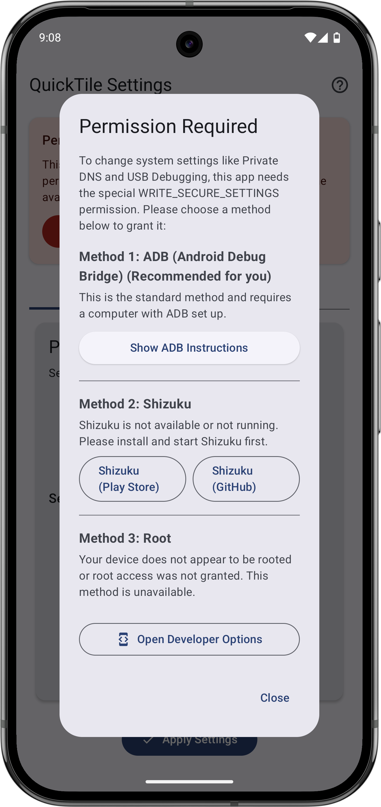
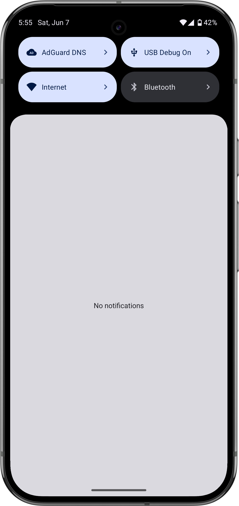

[](https://github.com/RBN-Apps/Quick-Tile-Settings/issues)
[](https://github.com/RBN-Apps/Quick-Tile-Settings/commits/main)
[](https://github.com/RBN-Apps/Quick-Tile-Settings/releases/latest)
[](https://android-arsenal.com/api?level=29)
[](https://github.com/RBN-Apps/Quick-Tile-Settings/stargazers)
[](https://github.com/RBN-Apps/Quick-Tile-Settings/network/members)
[](https://deepwiki.com/RBN-Apps/Quick-Tile-Settings)

# Quick-Tile Settings

**Quick-Tile Settings** is an Android application that provides customizable Quick Settings tiles
for managing Private DNS and USB Debugging. It allows users to quickly toggle these settings and
configure the behavior of each tile, including an auto-revert feature.

A significant portion of the Private DNS tile functionality and concept is inspired by Joshua
Wolfsohn's [Private DNS Quick Tile](https://github.com/joshuawolfsohn/Private-DNS-Quick-Tile) app.
This project aims to expand on that idea by adding more features, a USB Debugging tile, and a modern
Jetpack Compose UI.

## Features

* **Private DNS Quick Tile:**
    * Cycle through Off, Auto, and user-selected Private DNS hostnames.
    * Manage a list of DNS hostnames:
        * Includes predefined options: Cloudflare (Performance & Privacy), AdGuard DNS (Ad & Tracker
          Blocking), Quad9 (Security Focus).
        * Add, edit, and delete custom DNS hostname entries.
        * Select which hostnames (along with Off/Auto) are included in the tile's cycle.
    * View information about the benefits of each predefined DNS provider directly in the app.
    * Optional: Automatically revert to the previous DNS state after a configurable delay.
* **USB Debugging Quick Tile:**
    * Toggle USB Debugging On or Off.
    * Configure whether to cycle between On/Off or only include specific states.
    * Optional: Automatically revert to the previous USB Debugging state after a configurable delay.
* **User-Friendly Configuration:**
    * In-app settings screen to customize tile behavior and auto-revert options.
    * Tabbed interface for easy navigation between Private DNS and USB Debugging settings.
* **Multiple Permission Granting Options:**
    * Clear instructions and an in-app dialog for granting the required `WRITE_SECURE_SETTINGS`
      permission via ADB (Android Debug Bridge), Shizuku, or Root.
    * Convenient "Copy Command" buttons for ADB commands.
* **Modern UI:** Built with Jetpack Compose, supporting dynamic color (Material You) on Android 12+.
* **Localization:** Available in English and German.

## Screenshots

<p align="center">
  
  
  
  
</p>

## Requirements

* Android 9 (Pie, API 29) or higher.
* The `WRITE_SECURE_SETTINGS` permission. This **must** be granted using one of the methods
  described below as it's a protected permission not available to regular apps.

## Setup and Usage

### 1. Granting the `WRITE_SECURE_SETTINGS` Permission

This app requires the `WRITE_SECURE_SETTINGS` permission to modify system settings for Private DNS
and USB Debugging. This permission cannot be granted by the app itself through the standard Android
permission dialog. You must use one of the following methods. The app provides an in-app dialog (
accessible via the help icon "?" in the toolbar) that guides you through these options.

#### Method 1: ADB (Android Debug Bridge) - Recommended for most users without Root/Shizuku

This method requires a computer with ADB set up.

1. **Enable Developer Options and USB Debugging on your Android device:**
    * Go to `Settings > About phone`.
    * Tap on `Build number` repeatedly (usually 7 times) until you see a message saying "You are now
      a developer!".
    * Go to `Settings > System > Developer options` (the location might vary slightly by device).
    * Enable `USB debugging`.
2. **Connect your device to your computer** via USB.
3. **Ensure ADB is installed** on your computer. (Search "install ADB" for instructions specific to
   your OS).
4. **Grant the permission using one of the following ADB commands:**
    * **Option A (If app is already installed):**
     ```bash
     adb shell pm grant com.rbn.qtsettings android.permission.WRITE_SECURE_SETTINGS
     ```
    * **Option B (Grant during installation):**
      (First, uninstall the app if it's already present without the permission)
     ```bash
     adb install -g -r path/to/your/app.apk
     ```

   Replace `path/to/your/app.apk` with the actual path to the APK file. The `-g` flag grants all
   runtime permissions listed in the manifest, which for this app effectively grants
   `WRITE_SECURE_SETTINGS` due to how it's declared.

   The in-app help dialog provides copy buttons for these commands.

#### Method 2: Shizuku

[Shizuku](https://shizuku.rikka.app/) allows apps to use system APIs with elevated privileges. If
you have Shizuku installed and running (either via ADB or Root), you can grant the permission
through it.

1. **Install and set up Shizuku** on your device. Follow the instructions provided by the Shizuku
   app.
2. Open **Quick-Tile Settings**. If Shizuku is running, the in-app permission dialog will offer a "
   Grant using Shizuku" option.
3. If Quick-Tile Settings doesn't yet have permission to *use* Shizuku, you'll first be prompted to
   grant that via a Shizuku system dialog.
4. Once Quick-Tile Settings has permission to use Shizuku, tapping "Grant using Shizuku" will
   attempt to set the `WRITE_SECURE_SETTINGS` permission.

#### Method 3: Root

If your device is rooted, the app can attempt to grant the permission using root privileges.

1. Ensure your device is properly rooted and a root management app (like Magisk) is installed and
   allows root access requests.
2. Open **Quick-Tile Settings**. The in-app permission dialog will detect root and offer a "Grant
   using Root" option.
3. Tapping this button will prompt your root management app to grant root access to Quick-Tile
   Settings for executing the permission grant command.

**After granting the permission using any method, the app should detect it. You might need to
restart the app or pull down the Quick Settings panel again for the tiles to become fully
functional.**

### 2. Configure Tiles in the App

1. Open the **Quick-Tile Settings** app.
2. If the permission hasn't been granted, you'll see a warning. Use the help icon (`?`) in the
   toolbar to access the permission granting options.
3. Navigate to the **"Private DNS"** or **"USB Debugging"** tab.
4. **For Private DNS:**
    * **Select Cycle States:** Check the boxes for "DNS Off" and "DNS Auto" if you want them in the
      cycle.
    * **Manage Hostnames:**
        * A list of DNS providers (predefined and custom) is shown.
        * Check the box next to each hostname to include it in the tile's cycle.
        * For predefined hostnames, tap the info icon (ⓘ) to learn about their benefits.
        * Tap "Add Custom Hostname" to add your own DNS provider (you'll need a display name and the
          actual hostname).
        * Custom hostnames can be edited or deleted.
5. **For USB Debugging:**
    * **Select Cycle States:** Check "USB Debug On" and/or "USB Debug Off" to include them in the
      cycle.
6. **Auto-Revert (Optional):**
    * Enable "Enable auto-revert after a delay".
    * Set the "Revert delay (seconds)". The setting will revert to its previous state after this
      many seconds.
7. Tap the **"Apply Settings"** button (checkmark icon at the bottom). A snackbar will confirm that
   settings are saved.

### 3. Add Tiles to Your Quick Settings Panel

1. Pull down your notification shade fully to reveal the Quick Settings panel.
2. Tap the **"edit" icon** (often a pencil) or an option like "Edit tiles".
3. Find the **"Private DNS"** and **"USB Debugging"** tiles provided by this app (they will have the
   app's icon or a relevant icon for DNS/USB).
4. Drag and drop them from the "available tiles" area to your active tiles area.
5. Arrange them as desired and tap "Done" or the checkmark.

### 4. Using the Tiles

* **Tap a tile** in your Quick Settings panel to cycle it to the next configured state.
* **Long-press a tile** to open the Quick-Tile Settings app.

## Auto-Revert Feature Explained

* When auto-revert is enabled for a tile:
    * Tapping the tile to change a setting will initiate a countdown timer (visible via a toast
      message).
    * If no further action is taken, the setting will automatically revert to the state it was in
      *before* you tapped the tile once the timer finishes.
    * If you tap the tile *again* before the timer finishes, the auto-revert for the *previous*
      change is cancelled. The tile will proceed to its next state, and if that new state change
      also has auto-revert configured, a *new* timer will begin.
* This feature is useful for temporarily enabling a setting (like USB Debugging for a quick ADB
  command or you want to visit an advertisement website on purpose once) and having it automatically
  disable itself for security or convenience.

## Building from Source

1. Clone this repository:
   ```bash
   git clone https://github.com/RBN-Apps/Quick-Tile-Settings.git
   ```
2. Open the project in Android Studio.
3. Let Gradle sync and download dependencies.
4. Build the project (e.g., `Build > Make Project` or `Run 'app'`).
   The APK will typically be found in `app/build/outputs/apk/debug/` or
   `app/build/outputs/apk/release/`.
